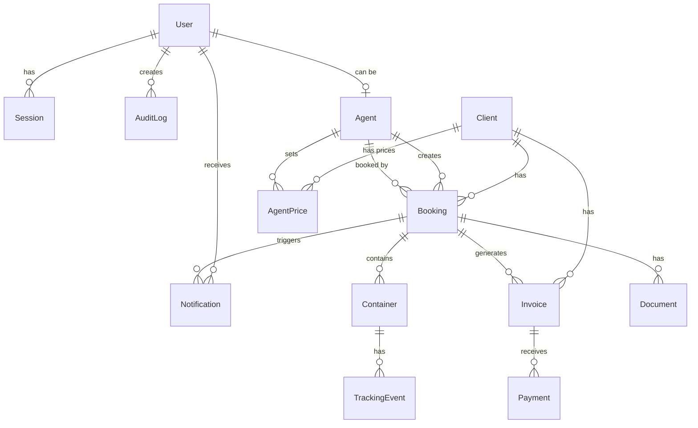

# Database Schema Documentation

**Версия:** 1.0  
**Дата:** 18 декабря 2025

---

## 📊 Entity-Relationship Diagram



---

## 📋 Основные Таблицы

### Users (Пользователи)

**Назначение:** Хранение информации о пользователях системы

**Ключевые поля:**
- `id` (UUID) - уникальный идентификатор
- `email` (String, unique) - email для входа
- `passwordHash` (String) - хеш пароля (bcrypt)
- `role` (Enum) - роль: SUPER_ADMIN, ADMIN, MANAGER, OPERATOR, CLIENT
- `emailVerified` (Boolean) - подтвержден ли email
- `verificationToken` (String) - токен для верификации
- `resetToken` (String) - токен для сброса пароля

**Индексы:**
- `email` (unique)

**Связи:**
- One-to-Many: Sessions, Notifications, AuditLogs
- One-to-One: Agent (опционально)

---

### Clients (Клиенты/Компании)

**Назначение:** Хранение информации о клиентах-компаниях

**Ключевые поля:**
- `id` (UUID)
- `companyName` (String) - название компании
- `email` (String, unique) - email компании
- `taxId` (String, unique) - CUI/код налогоплательщика
- `status` (Enum) - ACTIVE, INACTIVE, SUSPENDED
- `totalBookings` (Int) - статистика
- `totalRevenue` (Float) - статистика

**Индексы:**
- `email` (unique)
- `taxId` (unique)
- `status`

**Связи:**
- One-to-Many: Bookings, Invoices

---

### Bookings (Бронирования)

**Назначение:** Хранение информации о бронированиях контейнеров

**Ключевые поля:**
- `id` (String) - формат: PE2512001
- `clientId` (UUID, FK) - клиент
- `agentId` (UUID, FK, optional) - агент
- `portOrigin` (String) - порт отправления
- `portDestination` (String) - порт назначения
- `containerType` (String) - тип контейнера
- `status` (Enum) - CONFIRMED, SENT, IN_TRANSIT, ARRIVED, DELIVERED, CANCELLED
- `eta` (DateTime) - ожидаемое время прибытия
- `totalPrice` (Float) - общая стоимость

**Индексы:**
- `clientId`
- `agentId`
- `status`

**Связи:**
- Many-to-One: Client, Agent
- One-to-Many: Containers, Documents, Invoices, Notifications

---

### Containers (Контейнеры)

**Назначение:** Хранение информации о конкретных контейнерах

**Ключевые поля:**
- `id` (UUID)
- `bookingId` (String, FK) - бронирование
- `containerNumber` (String, unique) - номер контейнера
- `type` (String) - тип контейнера
- `currentStatus` (String) - текущий статус
- `currentLocation` (String) - текущая локация
- `eta` (DateTime) - ожидаемое время прибытия
- `actualArrival` (DateTime) - фактическое прибытие

**Индексы:**
- `bookingId`
- `containerNumber` (unique)

**Связи:**
- Many-to-One: Booking
- One-to-Many: TrackingEvents

---

### TrackingEvents (События отслеживания)

**Назначение:** История всех событий отслеживания контейнера

**Ключевые поля:**
- `id` (UUID)
- `containerId` (UUID, FK) - контейнер
- `eventType` (String) - тип события
- `eventDate` (DateTime) - дата события
- `location` (String) - локация
- `latitude` (Float) - широта
- `longitude` (Float) - долгота
- `vessel` (String) - название судна

**Индексы:**
- `containerId`
- `eventDate`

**Связи:**
- Many-to-One: Container

---

### Invoices (Счета/Фактуры)

**Назначение:** Хранение информации о фактурах

**Ключевые поля:**
- `id` (UUID)
- `invoiceNumber` (String, unique) - номер фактуры
- `bookingId` (String, FK) - бронирование
- `clientId` (UUID, FK) - клиент
- `amount` (Float) - сумма
- `currency` (String) - валюта
- `status` (Enum) - UNPAID, PAID, OVERDUE, CANCELLED
- `issueDate` (DateTime) - дата выдачи
- `dueDate` (DateTime) - срок оплаты
- `paidDate` (DateTime, optional) - дата оплаты

**Индексы:**
- `clientId`
- `status`
- `dueDate`
- `invoiceNumber` (unique)

**Связи:**
- Many-to-One: Booking, Client
- One-to-Many: Payments

---

### Payments (Платежи)

**Назначение:** Хранение информации о платежах

**Ключевые поля:**
- `id` (UUID)
- `invoiceId` (UUID, FK) - фактура
- `amount` (Float) - сумма платежа
- `currency` (String) - валюта
- `method` (String) - метод оплаты
- `reference` (String) - референс платежа
- `paidAt` (DateTime) - дата платежа

**Индексы:**
- `invoiceId`

**Связи:**
- Many-to-One: Invoice

---

## 🔍 Index Strategy

### Primary Indexes:
- Все таблицы имеют `id` как primary key (UUID)

### Unique Indexes:
- `User.email`
- `Client.email`
- `Client.taxId`
- `Container.containerNumber`
- `Invoice.invoiceNumber`

### Foreign Key Indexes:
- Все foreign keys индексированы для быстрых JOIN операций

### Composite Indexes:
- `Booking(clientId, status)` - для фильтрации по клиенту и статусу
- `Invoice(clientId, status, dueDate)` - для отчетов по фактурам
- `TrackingEvent(containerId, eventDate)` - для хронологии событий

---

## 🔄 Migration Strategy

### Используется Prisma Migrate:

```bash
# Создать новую миграцию
npx prisma migrate dev --name migration_name

# Применить миграции в production
npx prisma migrate deploy

# Откатить миграцию (development only)
npx prisma migrate reset
```

### Best Practices:

1. **Всегда создавать миграции** для изменений схемы
2. **Тестировать миграции** на staging перед production
3. **Backup базы данных** перед применением миграций
4. **Не редактировать** существующие миграции после применения

---

## 📈 Performance Considerations

### Query Optimization:

1. **Использовать индексы** для часто запрашиваемых полей
2. **Pagination** для больших списков (limit + offset)
3. **Select только нужные поля** вместо SELECT *
4. **Connection pooling** для управления соединениями

### Caching Strategy:

- **Redis** для кэширования:
  - Часто запрашиваемые данные (списки клиентов, контейнеров)
  - Сессии пользователей
  - Rate limiting counters

---

**Последнее обновление:** 18 декабря 2025

